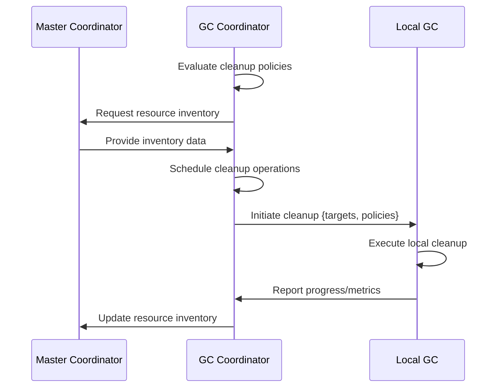
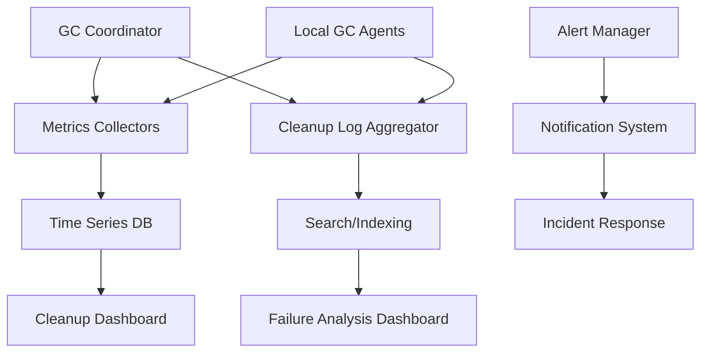

# Swarm Garbage Collector Design Document

## Overview

The Swarm Garbage Collector (SGC) is a distributed system component designed to automatically manage resource cleanup across the swarm infrastructure. Building upon the existing distributed orchestration architecture, the SGC handles automatic cleanup of logs, memory resources, and computational artifacts to maintain system health, optimize resource utilization, and prevent resource exhaustion.

The SGC extends the current SwarmSupervisor capabilities by adding proactive resource management alongside reactive monitoring. It operates as a distributed service with coordination through the Master Coordinator, ensuring consistent cleanup policies across all worker nodes while respecting node autonomy.

## Architecture

### System Integration

```
graph TD
    A[Master Coordinator] --> B[Garbage Collector Coordinator]
    B --> C[Cleanup Policy Engine]
    B --> D[Distributed Scheduler]
    B --> E[Resource Inventory]

    F[Worker Node 1] --> G[Local Garbage Collector]
    H[Worker Node 2] --> I[Local Garbage Collector]
    J[Worker Node N] --> K[Local Garbage Collector]

    B <--> G
    B <--> I
    B <--> K

    L[Monitoring System] --> B
    L --> G
    L --> I
    L --> K

    M[Client Applications] --> A
```

### Core Components

#### Garbage Collector Coordinator (Master)
- **Central orchestration** for swarm-wide cleanup operations
- **Policy enforcement** ensuring consistent cleanup rules across nodes
- **Coordination hub** for distributed cleanup scheduling
- **Resource inventory management** tracking cleanup-eligible resources
- **Failure handling** for cleanup operation failures

#### Local Garbage Collectors (Workers)
- **Node-specific cleanup execution** respecting local resource constraints
- **Resource-aware operations** preventing cleanup-induced performance degradation
- **Health reporting** to coordinator during and after cleanup
- **Graceful degradation** when resources are critically low

#### Cleanup Policy Engine
- **Rule evaluation** for what resources qualify for cleanup
- **Priority assignment** for different cleanup targets
- **Safety checks** preventing premature cleanup of active resources
- **Customization support** for node-specific policies

#### Distributed Scheduler
- **Cleanup timing coordination** across the swarm
- **Load balancing** preventing simultaneous cleanup storms
- **Dependency resolution** ensuring safe cleanup sequences
- **Resource reservation** for cleanup operations themselves

### Communication Protocols

#### Cleanup Coordination Protocol



## Cleanup Policies

### Log Cleanup Policies

#### Log Rotation Strategy
- **Time-based rotation**: Logs older than 30 days automatically archived
- **Size-based rotation**: Log files exceeding 1GB compressed and archived
- **Priority-based retention**: Error/critical logs retained 90 days, info/debug 30 days
- **Compression**: Archived logs compressed with gzip (70-80% size reduction)

#### Log Types and Retention
- **Application logs**: 30 days active, 90 days archived
- **System logs**: 60 days active, 180 days archived
- **Audit logs**: 365 days active, indefinite archived
- **Debug logs**: 7 days active, 30 days archived

### Memory Cleanup Policies

#### Memory Pool Management
- **Cache eviction**: LRU eviction for inactive cached data
- **Session cleanup**: Completed sessions cleaned after 1 hour grace period
- **Temporary buffers**: Immediate cleanup of unused temporary allocations
- **Memory defragmentation**: Periodic compaction when fragmentation > 50%

#### Memory Thresholds
- **Warning threshold**: 80% memory utilization triggers cleanup
- **Critical threshold**: 95% memory utilization forces aggressive cleanup
- **Recovery target**: Cleanup until utilization < 70%

### Resource Cleanup Policies

#### Computational Resources
- **Idle GPU workers**: Shutdown after 15 minutes of inactivity
- **Completed tasks**: Cleanup artifacts immediately after completion
- **Failed tasks**: Retain for 24 hours for debugging, then cleanup
- **Stale sessions**: Sessions inactive > 4 hours marked for cleanup

#### Storage Resources
- **Temporary files**: Immediate cleanup after task completion
- **Checkpoint data**: Retained 7 days for task recovery, then archived
- **Model caches**: LRU eviction when storage > 80% capacity
- **Archived data**: Moved to cold storage after 90 days

### Safety and Validation Policies

#### Pre-Cleanup Validation
- **Activity checks**: Ensure resources not actively used
- **Dependency analysis**: Prevent cleanup of resources with active dependencies
- **Health verification**: Skip cleanup on unhealthy nodes
- **Quota enforcement**: Respect per-node cleanup limits

#### Rollback Mechanisms
- **Snapshot preservation**: Pre-cleanup state snapshots for recovery
- **Incremental cleanup**: Small batches with verification between steps
- **Emergency stop**: Ability to halt cleanup operations mid-execution

## Scheduling

### Scheduling Architecture

#### Distributed Scheduling Algorithm
1. **Resource assessment**: Evaluate current utilization across swarm
2. **Load balancing**: Distribute cleanup operations to prevent performance impact
3. **Dependency ordering**: Schedule cleanup in safe dependency order
4. **Time windowing**: Schedule during low-activity periods when possible

#### Cleanup Windows
- **Maintenance windows**: Dedicated 2-hour windows for intensive cleanup
- **Off-peak scheduling**: Automatic scheduling during 2-6 AM local time
- **Continuous cleanup**: Low-impact cleanup running continuously
- **On-demand triggers**: Immediate cleanup when thresholds exceeded

### Scheduling Policies

#### Frequency Configuration
- **Log rotation**: Hourly checks, daily execution
- **Memory cleanup**: Continuous monitoring, triggered every 5 minutes
- **Resource cleanup**: Every 15 minutes during active hours
- **Deep cleanup**: Weekly during maintenance windows

#### Priority Scheduling
- **Critical cleanup**: Immediate execution (memory pressure, disk full)
- **High priority**: Within 5 minutes (log rotation, session cleanup)
- **Normal priority**: Within 15 minutes (cache eviction, temp files)
- **Low priority**: Within 1 hour (archival, compression)

## Monitoring

### Metrics Collection

#### Cleanup Metrics
- **Operation success rate**: Percentage of successful cleanup operations
- **Resource reclamation**: Amount of resources freed per operation
- **Execution time**: Time taken for cleanup operations
- **Failure analysis**: Categorization of cleanup failures

#### Performance Impact Metrics
- **CPU overhead**: Additional CPU usage during cleanup
- **Memory overhead**: Memory usage of cleanup processes
- **I/O impact**: Disk I/O generated by cleanup operations
- **Network impact**: Inter-node communication for coordination

### Monitoring Architecture



### Alerting and Notifications

#### Alert Types
- **Cleanup failures**: Failed operations requiring manual intervention
- **Performance impact**: Cleanup causing >10% performance degradation
- **Resource exhaustion**: Cleanup unable to free sufficient resources
- **Policy violations**: Cleanup operations violating safety policies

#### Escalation Procedures
- **Warning**: Email notifications for non-critical issues
- **Critical**: Pager/SMS alerts for system-threatening conditions
- **Emergency**: Automated system pauses for critical resource exhaustion

### Dashboard Views

#### Swarm Overview Dashboard
- Total resources cleaned across swarm
- Cleanup operation success rates
- Resource utilization trends post-cleanup
- Active cleanup operations status

#### Node-Specific Dashboard
- Local cleanup history and metrics
- Resource utilization before/after cleanup
- Cleanup operation queue and status
- Performance impact graphs

## Implementation Considerations

### Integration Points
- **Existing monitoring**: Extends SwarmSupervisor monitoring capabilities
- **Resource manager**: Coordinates with GPU resource allocation
- **Task scheduler**: Awareness of active tasks to prevent premature cleanup
- **Health checks**: Cleanup operations respect node health status

### Scalability Considerations
- **Horizontal scaling**: GC coordinators can be distributed for large swarms
- **Resource efficiency**: Cleanup operations themselves are resource-aware
- **Network efficiency**: Minimized inter-node communication for status updates
- **Storage efficiency**: Compressed archival and efficient indexing

### Security Considerations
- **Access control**: Cleanup operations require appropriate permissions
- **Audit logging**: All cleanup operations are logged for compliance
- **Data protection**: Sensitive data properly handled during cleanup
- **Integrity checks**: Verification that cleanup doesn't corrupt active data

### Deployment Strategy
1. **Pilot deployment**: Single node with GC agent for testing
2. **Gradual rollout**: Enable GC on additional nodes incrementally
3. **Feature flags**: Ability to disable GC components if issues arise
4. **Monitoring-first**: Extensive monitoring before full automation

### Success Metrics
- **Resource efficiency**: >90% consistent resource utilization
- **System stability**: <1% cleanup-related incidents
- **Performance impact**: <5% average performance degradation during cleanup
- **Operational overhead**: <2% of total system resources used for cleanup

This design provides a comprehensive, distributed garbage collection system that maintains swarm health while minimizing operational overhead and ensuring system reliability.