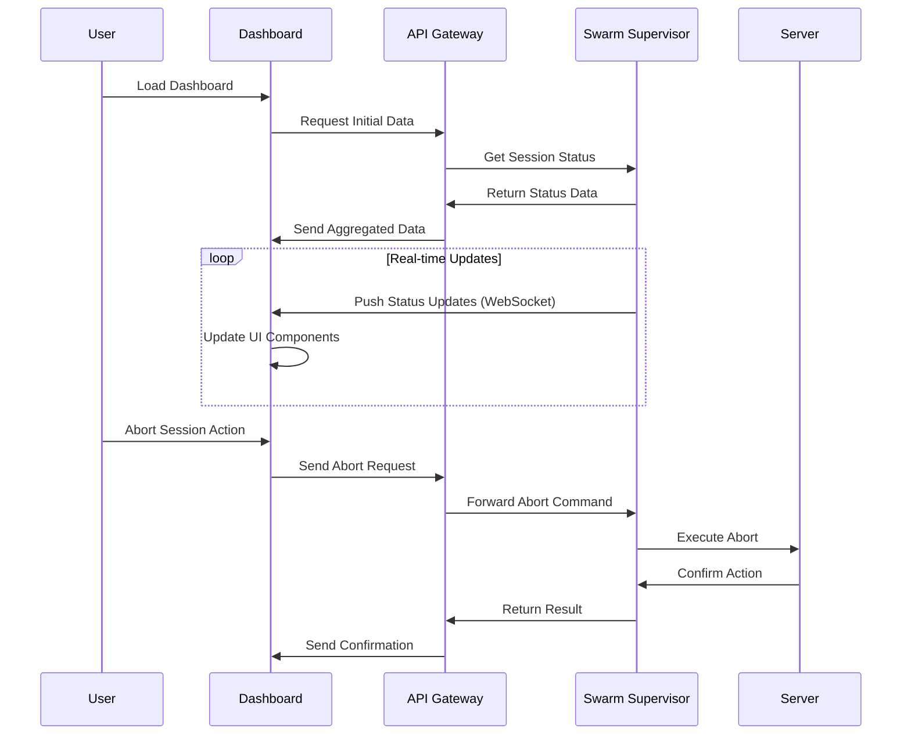

# Swarm Control Center Dashboard Design Document

## Overview

The Swarm Control Center Dashboard is a comprehensive web-based interface designed to provide real-time monitoring and control capabilities for the swarm supervisor system. Building upon the existing SwarmSupervisor infrastructure, the dashboard enables operators to visualize swarm health, monitor session activities, manage stalled operations, and perform manual interventions when necessary.

The dashboard extends the monitoring capabilities of the SwarmSupervisor by adding a user-friendly interface that transforms raw status data into actionable insights. It operates as a client to the swarm supervisor API, providing both passive monitoring and active control functionality.

## Architecture

### System Integration

```
graph TD
    A[Swarm Control Center Dashboard] --> B[Dashboard API Gateway]
    B --> C[Swarm Supervisor]
    B --> D[Server API]

    E[Web Browser] --> A

    C --> F[Session Status Endpoint]
    C --> G[Abort Endpoint]
    D --> H[Health Check Endpoint]

    I[Real-time Stream] --> A
    I --> C
```

### Core Components

#### Frontend Dashboard
- **User Interface Layer**: SolidJS-based responsive web application
- **Real-time Data Visualization**: Live charts and status indicators
- **Control Interfaces**: Interactive panels for manual operations
- **Authentication & Authorization**: Secure access controls

#### API Gateway
- **Request Routing**: Proxy for swarm supervisor and server APIs
- **Data Aggregation**: Combine multiple data sources into unified responses
- **Rate Limiting**: Prevent API abuse and ensure system stability
- **Error Handling**: Graceful degradation and user feedback

#### Real-time Data Stream
- **WebSocket Connection**: Persistent connection for live updates
- **Event Broadcasting**: Push notifications for status changes
- **Connection Management**: Automatic reconnection and failover

#### Control Interfaces
- **Session Management**: Abort, pause, resume operations
- **Configuration Updates**: Dynamic parameter adjustments
- **Emergency Controls**: System-wide shutdown or restart capabilities

### Data Flow Architecture



## UI Components

### Overview Dashboard
- **System Health Indicator**: Overall swarm status (healthy/warning/critical)
- **Active Sessions Counter**: Real-time count of running sessions
- **Performance Metrics**: CPU, memory, and network utilization graphs
- **Alert Summary**: Recent alerts and incidents

### Session Monitoring Panel
- **Session List Table**: Sortable table with session ID, status, duration, and actions
- **Status Filters**: Filter by busy/idle/retry/stalled states
- **Session Details Modal**: Detailed view of individual session metrics
- **Bulk Actions**: Select multiple sessions for batch operations

### Control Panel
- **Manual Abort Controls**: Emergency session termination with confirmation
- **Supervisor Settings**: Adjustable timeouts and check intervals
- **System Commands**: Restart supervisor, clear logs, system diagnostics

### Logs and Alerts Viewer
- **Real-time Log Stream**: Live feed of supervisor and session logs
- **Alert Notifications**: Toast notifications for critical events
- **Historical Logs**: Searchable and filterable log archive
- **Alert Management**: Acknowledge, escalate, or resolve alerts

### Settings and Configuration
- **Supervisor Configuration**: Edit monitoring parameters
- **Dashboard Preferences**: Theme, refresh rates, notification settings
- **User Management**: Access controls and permissions (future extension)

## Real-time Monitoring

### Data Sources
- **Session Status Stream**: Live updates from `/session/status` endpoint
- **Health Metrics**: Server health checks every 30 seconds
- **Performance Data**: System resource utilization
- **Log Events**: Real-time log aggregation

### Update Mechanisms
- **WebSocket Connection**: Primary real-time communication channel
- **Server-Sent Events (SSE)**: Fallback for environments without WebSocket support
- **Polling Fallback**: HTTP polling when real-time connections fail
- **Push Notifications**: Browser notifications for critical alerts

### Monitoring Capabilities
- **Session Lifecycle Tracking**: Start, busy, idle, completion, stall detection
- **Performance Thresholds**: Configurable alerts for resource utilization
- **Health Status Monitoring**: Automatic detection of unhealthy nodes
- **Trend Analysis**: Historical performance trends and predictions

### Data Refresh Rates
- **Critical Metrics**: < 5 seconds (session status, alerts)
- **Performance Data**: 30 seconds
- **Historical Trends**: 5 minutes
- **Log Aggregation**: Real-time with 1-second buffer

## Control Interfaces

### Session Management Controls
- **Abort Stalled Sessions**: One-click termination of sessions exceeding timeout
- **Force Abort**: Emergency termination without timeout checks
- **Session Pause/Resume**: Temporary suspension of processing (future feature)
- **Priority Adjustment**: Change session execution priority

### Supervisor Control
- **Parameter Updates**: Modify stall timeout, check intervals
- **Restart Operations**: Graceful restart of supervisor process
- **Log Rotation**: Manual trigger for log cleanup
- **Diagnostic Mode**: Enable enhanced logging for troubleshooting

### Emergency Controls
- **System Shutdown**: Coordinated shutdown of all swarm components
- **Maintenance Mode**: Temporarily disable new session acceptance
- **Resource Limits**: Dynamic adjustment of resource allocation
- **Failover Triggers**: Manual activation of backup systems

### Safety Mechanisms
- **Confirmation Dialogs**: Double-confirmation for destructive operations
- **Audit Logging**: All control actions logged for accountability
- **Rollback Capabilities**: Undo recent configuration changes
- **Access Controls**: Role-based permissions for different operations

## Integration Points

### Swarm Supervisor Integration
- **Status Endpoint**: `/session/status` for real-time session data
- **Abort Endpoint**: `/session/{id}/abort` for session termination
- **Configuration API**: Dynamic parameter updates (future extension)
- **Log Streaming**: Real-time log access for dashboard display

### Server API Integration
- **Health Check Endpoint**: Server health monitoring
- **Metrics Endpoint**: Performance and resource utilization data
- **Session Management**: Direct session control capabilities
- **System Diagnostics**: Comprehensive system health information

### Monitoring System Integration
- **Metrics Collection**: Integration with existing monitoring infrastructure
- **Alert Forwarding**: Push alerts to centralized monitoring systems
- **Log Aggregation**: Centralized log storage and analysis
- **Performance Monitoring**: Integration with APM tools

### Authentication and Security
- **Token-based Auth**: Integration with existing auth systems
- **Role-based Access**: Different permission levels for dashboard features
- **Audit Integration**: Control actions logged to security systems
- **Secure Communication**: HTTPS/WSS for all dashboard communications

## Implementation Considerations

### Technology Stack
- **Frontend Framework**: SolidJS (consistent with existing Kilo web components)
- **Backend API**: Python FastAPI extension to SwarmSupervisor
- **Real-time Communication**: WebSocket with SockJS fallback
- **Data Visualization**: Chart.js or D3.js for metrics display
- **State Management**: SolidJS signals for reactive UI updates

### Scalability Considerations
- **Horizontal Scaling**: Dashboard can serve multiple concurrent users
- **Data Optimization**: Efficient data structures for large session counts
- **Caching Strategy**: Client-side caching for frequently accessed data
- **Load Balancing**: Support for multiple dashboard instances

### Security Considerations
- **Input Validation**: All user inputs validated and sanitized
- **CSRF Protection**: Cross-site request forgery prevention
- **XSS Prevention**: Content security policies and escaping
- **Session Management**: Secure session handling and timeouts

### Deployment Strategy
1. **Containerization**: Dashboard deployed as Docker container
2. **Integration Testing**: End-to-end testing with SwarmSupervisor
3. **Gradual Rollout**: Feature flags for incremental deployment
4. **Monitoring**: Dashboard usage and performance monitoring

### Success Metrics
- **User Adoption**: >80% of operators using dashboard for monitoring
- **Incident Response**: 50% reduction in mean time to resolution
- **System Visibility**: Real-time awareness of all swarm activities
- **Operational Efficiency**: Reduced manual intervention requirements

## Implemented Components

### Cockpit Dashboard UI (SolidJS)
- **Location**: `packages/kilo-vscode/webview-ui/cockpit-dashboard/`
- **Provider**: `CockpitDashboardProvider` in VS Code extension
- **Features**:
  - Overview dashboard with system health, active sessions, performance metrics
  - Session monitoring panel with real-time status and bulk actions
  - Control panel for manual operations and supervisor settings
  - Logs and alerts viewer with real-time streaming
- **Integration**: WebSocket connection to swarm supervisor for live updates

### Agent Orchestration Pipeline
- **Location**: `supervisor/agent_orchestration.py`
- **Features**:
  - Pipeline workflow: Planner → Researcher → Coder → Tester
  - Parallel agent execution with session management
  - Task status tracking and pipeline monitoring
  - Automatic agent session creation and cleanup
- **Integration**: Uses SwarmSupervisor for agent session management

### Reasoning Fork Engine
- **Location**: `supervisor/reasoning_fork_engine.py`
- **Features**:
  - Parallel reasoning paths for complex problem-solving
  - Convergence evaluation with customizable criteria
  - Meta-reasoning for strategy selection
  - Subproblem decomposition and parallel solving
- **Integration**: Works with agent sessions for execution

### Integration and Logging
- All components integrate with SwarmSupervisor logging
- Events logged to `automation_log.md` for audit trail
- Real-time monitoring through Cockpit Dashboard
- CLI status reporting via `swarm_status.py`

This design provides a comprehensive control center that enhances swarm observability and control while maintaining the robustness and simplicity of the underlying SwarmSupervisor system.